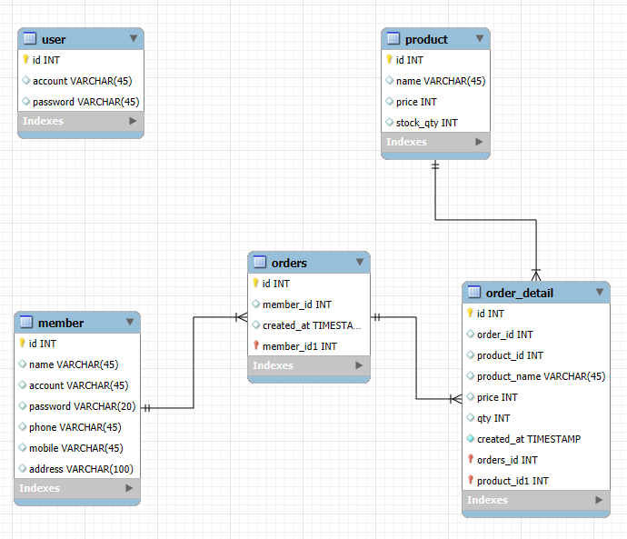
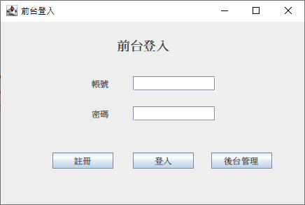
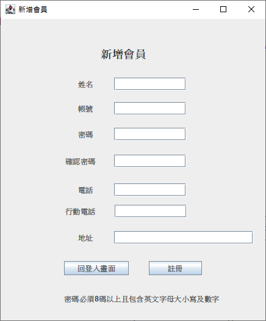
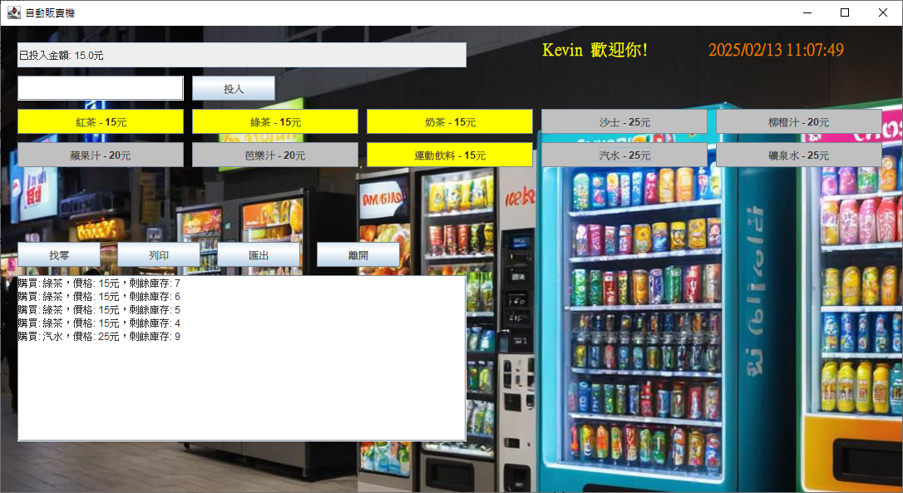
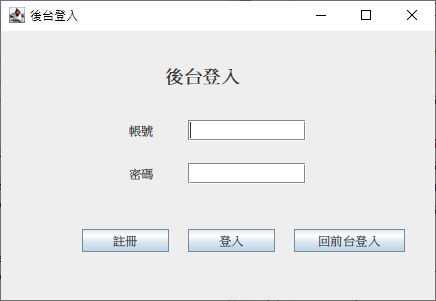
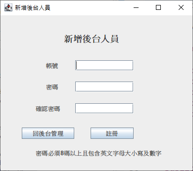
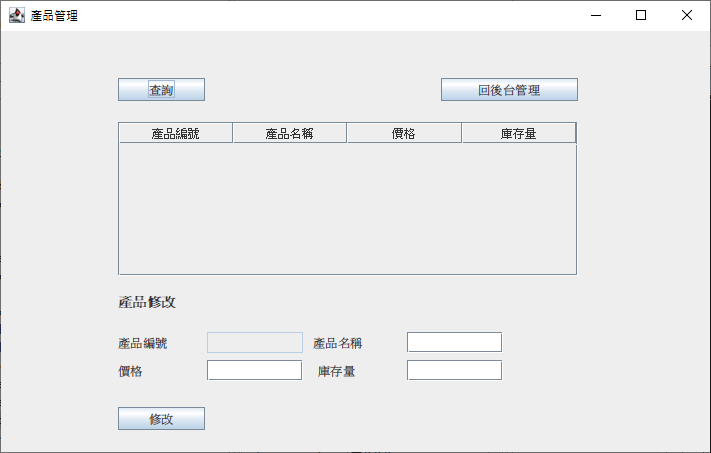

線上自動販賣機
===
主要為模擬實體販賣機運行。
### 1.資料庫介紹：
只有開一個資料庫：vending_machine
#### 1-1.資料表介紹:
user(後台使用者)、member(會員)、orders(訂單)、order_detail(訂單明細)、product(產品)。
#### 1-2.資料表關聯關係為
member.id(PK) -> orders.member_id(FK) 
orders.id(PK) -> order_detail.order_id(FK)
product.id(PK) -> order_detail.product_id(FK)

可參考以下關聯圖  

### 2.購物流程
#### 2-1.前台：
首先使用者需先註冊會員，之後再登入前台，登入後可進入販賣機的購賣頁面  
  
  
  

### 3.後台管理
#### 3.1.登入後台：
在前台登入畫面中有一個「後台管理」的按鈕，點選後可以進入後台登入畫面。若
沒有後台帳號資料，需要點選註冊，新增完後台帳號之後登入。  
  
  
#### 3.2.後台管理：
目前後台僅有產品管理功能，點擊後可進入產品管理功能。  
  
#### 3.3.產品管理
目前產品管理僅提供查詢及修改功能，因為前台的商品目前是限定10個。所以產品
這邊暫不開放新增及刪除功能，避免前台會有異常。  
  

#### 備註：
為避免有版權爭議，程式中所使用之圖片或音樂皆由AI協助生成，非由其他網站下載。

