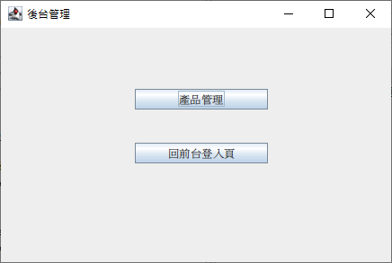
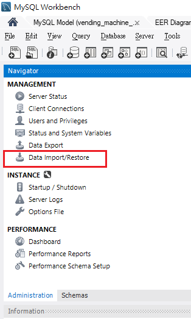

視窗版自動販賣機
===
主要為模擬實體販賣機運行。
### 1.系統架構說明
本系統由java語言開發，開發工具為eclipse搭配java JDK 11版本，資料庫為mysql: 8.0.41.0。
### 2.資料庫介紹
只有開一個資料庫：vending_machine
#### 2-1.資料表介紹
user(後台使用者)、member(會員)、orders(訂單)、order_detail(訂單明細)、product(產品)。
#### 2-2.資料表關聯關係為
member.id(PK) -> orders.member_id(FK)  
orders.id(PK) -> order_detail.order_id(FK)  
product.id(PK) -> order_detail.product_id(FK)  

可參考以下關聯圖  

### 3.購物流程
#### 3-1.前台
首先使用者需先註冊會員，之後再登入前台，登入後可進入販賣機的購賣頁面  
  
  
  

### 4.後台管理
#### 4-1.登入後台
在前台登入畫面中有一個「後台管理」的按鈕，點選後可以進入後台登入畫面。若
沒有後台帳號資料，需要點選註冊，新增完後台帳號之後登入。  
  
  
#### 4-2.後台管理
目前後台僅有產品管理功能，點擊後可進入產品管理功能。  
  
#### 4-3.產品管理
目前產品管理僅提供查詢及修改功能，因為前台的商品目前是限定10個。所以產品
這邊暫不開放新增及刪除功能，避免前台會有異常。  
  

### 5.安裝說明
#### 5-1.預先安裝
(1)請先安裝java jdk 11以上版本，建議11版本即可太高版可能會有問題。  
(2)mysq的版本建議: 8.0.41.0。  
(3)mysql開發工具「MySQL Workbench」，或有其他熟悉開發工具也可。  

#### 5-2.資料庫部份
請參考附圖：  
首先請先開啟MySQL開發工具MySQL Workbench  
  
    
之後資料夾選擇 「VendingMachine\sql」，再按「Start Import」按鈕即可。

#### 5-3.程式執行
請修改VendingMachine/可執行jar檔/config.ini中的資料庫路徑、連線密碼後，直接點選此資料夾VendingMachine.jar檔即可運行。

#### 備註：
為避免有版權爭議，程式中所使用之圖片或音樂皆由AI協助生成，非由其他網站下載

